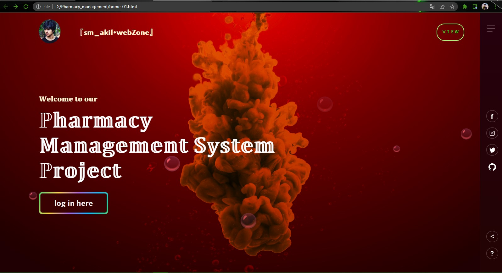

[![Contributors][contributors-shield]][contributors-url]
[![Forks][forks-shield]][forks-url]
[![Stargazers][stars-shield]][stars-url]
[![Issues][issues-shield]][issues-url]
[![MIT License][license-shield]][license-url]
[![LinkedIn][linkedin-shield]][linkedin-url]

<!-- PROJECT LOGO -->
 

    
  </a>

  <h3 align="center"> *🎀【𝓟𝓱𝓪𝓻𝓶𝓪𝓬𝔂 𝓜𝓪𝓷𝓪𝓰𝓮𝓶𝓮𝓷𝓽 𝓢𝔂𝓼𝓽𝓮𝓶】🎀*</h3>

  

    I worked on this Pharmacy~Management projrct for Software Developing Course.
     
       <strong>:lock:Created by ~ 𝕊𝕒𝕪𝕖𝕕 𝕄𝔻. 𝕊𝕒𝕕𝕚𝕜 𝕀𝕢𝕓𝕒𝕝 𝔸𝕜𝕚𝕝:shield:</strong> 
       <strong>:lock:ID ~ 『𝟭𝟴𝟬𝟯𝟱𝟭𝟬𝟮𝟬𝟭𝟲𝟲𝟰(𝗕𝟭)』:shield:</strong>
     
     
    <a href="https://github.com/othneildrew/Best-README-Template">View Demo</a>
    ·
    <a href="https://github.com/othneildrew/Best-README-Template/issues">Report Bug</a>
    ·
    <a href="https://github.com/othneildrew/Best-README-Template/issues">Request Feature</a>
  

<!-- TABLE OF CONTENTS -->

  
Table of Contents

  <ol>
    <li>
      <a href="#about-the-project">About The Project</a>
    </li>
      <ul>
        <li><a href="#built-with">Built With</a></li>
      </ul>
    </li>
    <li>
      <a href="#getting-started">Getting Started</a>
      <ul>
        <li><a href="#prerequisites">Prerequisites</a></li>
        <li><a href="#installation">Installation</a></li>
      </ul>
    </li>
    <li><a href="#usage">Usage</a></li>
    <li><a href="#roadmap">Roadmap</a></li>
    <li><a href="#contributing">Contributing</a></li>
    <li><a href="#license">License</a></li>
    <li><a href="#contact">Contact</a></li>
    <li><a href="#acknowledgments">Acknowledgments</a></li>
  </ol>

<!-- ABOUT THE PROJECT -->
## About The Project :
 

 
:syringe: :syringe: One of the core roles of a pharmacy management is to oversee the pharmacy staff and manage the people in order to maintain positive work relations and results. There are several different types of pharmacy staff, including pharmacists, pharmacy assistants and pharmacy technicians. :syringe::syringe:
 
 
:pill:Objective : 
The main objective of the Pharmacy Management System is to manage the details of Medicines, Stocks, Inventory,Pharmacy, Sells. It manages all the information about Medicines, Company, Sells, Medicines. The project is totally built at administrative end and thus only the administrator is guaranteed the access :v:   
 

:pill:Data Flow Diagram of my Phermacy Management Project :  

 

:pill:Typical features to think about Pharmacy Management System : 
* Control stock by product and location
* Get stock updates to know when purchasing a particular drug again
* Generate reports to plan re-stocking
* Get notifications when it’s time to order from your suppliers

:pill:Prescription handling : 
Another thing to ease the workflow is to make prescription management fast and error-free. Pharmaceutical software solutions make the preparation, pick-up, and refill process a matter of minutes. The result? Less incoming calls, fewer queues, and more happy customers.

:pill:Financial management :  
Billing is another pain point of the pharma business as it involves three parties: consumer, pharmacy, supplier. Automating the billing procedures is a necessity and the business better invest in it to avoid mistakes. 
It should take care of : 
* Daily transactions
* Supply billing
* Insurance reimbursemen
* Delayed payments

:pill:How to Develop a Pharmacy Management Software in 6 Steps : 
* [:drop_of_blood:] State the business goal.
* [:drop_of_blood:] Write out your requirements.
* [:drop_of_blood:] Listen to the users.
* [:drop_of_blood:] Record the insights.
* [:drop_of_blood:] Find a vendor.
* [:drop_of_blood:] Test with real users.

(<a href="#readme-top">back to top</a>)

### Built With

This section should list any major frameworks/libraries used to bootstrap your project. Leave any add-ons/plugins for the acknowledgements section. Here are a few examples.

* [![Next][Next.js]][Next-url]
* [![React][React.js]][React-url]
* [![Vue][Vue.js]][Vue-url]
* [![Angular][Angular.io]][Angular-url]
* [![Bootstrap][Bootstrap.com]][Bootstrap-url]
* [![JQuery][JQuery.com]][JQuery-url]

(<a href="#readme-top">back to top</a>)

<!-- GETTING STARTED -->
## Getting Started

This is an example of how you may give instructions on setting up your project locally.
To get a local copy up and running follow these simple example steps.

## Usage

Use this space to show useful examples of how a project can be used. Additional screenshots, code examples and demos work well in this space. You may also link to more resources.

_For more examples, please refer to the [Documentation](https://example.com)_

(<a href="#readme-top">back to top</a>)

<!-- CONTRIBUTING -->
## Contributing

Contributions are what make the open source community such an amazing place to learn, inspire, and create. Any contributions you make are **greatly appreciated**.

If you have a suggestion that would make this better, please fork the repo and create a pull request. You can also simply open an issue with the tag "enhancement".
Don't forget to give the project a star! Thanks again!

1. Fork the Project
2. Create your Feature Branch (`git checkout -b feature/AmazingFeature`)
3. Commit your Changes (`git commit -m 'Add some AmazingFeature'`)
4. Push to the Branch (`git push origin feature/AmazingFeature`)
5. Open a Pull Request

(<a href="#readme-top">back to top</a>)

<!-- LICENSE -->
## License

Distributed under the MIT License. See `LICENSE.txt` for more information.

(<a href="#readme-top">back to top</a>)

<!-- CONTACT -->
## Contact

𝕤𝕞_𝕒𝕜𝕚𝕝 - [@akil_sm9](https://twitter.com/akil_sm9) - akil.ckb@gmail.com

Project Link: [https://github.com/sm-akil/PharmacyManagementSystem](https://github.com/sm-akil/PharmacyManagementSystem)

(<a href="#readme-top">back to top</a>)

<!-- ACKNOWLEDGMENTS -->
## Acknowledgments

Use this space to list resources you find helpful and would like to give credit to. I've included a few of my favorites to kick things off!

* [Choose an Open Source License](https://choosealicense.com)
* [GitHub Emoji Cheat Sheet](https://www.webpagefx.com/tools/emoji-cheat-sheet)
* [Malven's Flexbox Cheatsheet](https://flexbox.malven.co/)
* [Malven's Grid Cheatsheet](https://grid.malven.co/)
* [Img Shields](https://shields.io)
* [GitHub Pages](https://pages.github.com)
* [Font Awesome](https://fontawesome.com)
* [React Icons](https://react-icons.github.io/react-icons/search)

(<a href="#readme-top">back to top</a>)

<!-- MARKDOWN LINKS & IMAGES -->
<!-- https://www.markdownguide.org/basic-syntax/#reference-style-links -->
[contributors-shield]: https://img.shields.io/github/contributors/othneildrew/Best-README-Template.svg?style=for-the-badge
[contributors-url]: https://github.com/othneildrew/Best-README-Template/graphs/contributors
[forks-shield]: https://img.shields.io/github/forks/othneildrew/Best-README-Template.svg?style=for-the-badge
[forks-url]: https://github.com/othneildrew/Best-README-Template/network/members
[stars-shield]: https://img.shields.io/github/stars/othneildrew/Best-README-Template.svg?style=for-the-badge
[stars-url]: https://github.com/othneildrew/Best-README-Template/stargazers
[issues-shield]: https://img.shields.io/github/issues/othneildrew/Best-README-Template.svg?style=for-the-badge
[issues-url]: https://github.com/othneildrew/Best-README-Template/issues
[license-shield]: https://img.shields.io/github/license/othneildrew/Best-README-Template.svg?style=for-the-badge
[license-url]: https://github.com/othneildrew/Best-README-Template/blob/master/LICENSE.txt
[linkedin-shield]: https://img.shields.io/badge/-LinkedIn-black.svg?style=for-the-badge&logo=linkedin&colorB=555
[linkedin-url]: https://linkedin.com/in/othneildrew
[product-screenshot]: images/screenshot.png
[Next.js]: https://img.shields.io/badge/next.js-000000?style=for-the-badge&logo=nextdotjs&logoColor=white
[Next-url]: https://nextjs.org/
[React.js]: https://img.shields.io/badge/React-20232A?style=for-the-badge&logo=react&logoColor=61DAFB
[React-url]: https://reactjs.org/
[Vue.js]: https://img.shields.io/badge/Vue.js-35495E?style=for-the-badge&logo=vuedotjs&logoColor=4FC08D
[Vue-url]: https://vuejs.org/
[Angular.io]: https://img.shields.io/badge/Angular-DD0031?style=for-the-badge&logo=angular&logoColor=white
[Angular-url]: https://angular.io/
[Svelte.dev]: https://img.shields.io/badge/Svelte-4A4A55?style=for-the-badge&logo=svelte&logoColor=FF3E00
[Svelte-url]: https://svelte.dev/
[Laravel.com]: https://img.shields.io/badge/Laravel-FF2D20?style=for-the-badge&logo=laravel&logoColor=white
[Laravel-url]: https://laravel.com
[Bootstrap.com]: https://img.shields.io/badge/Bootstrap-563D7C?style=for-the-badge&logo=bootstrap&logoColor=white
[Bootstrap-url]: https://getbootstrap.com
[JQuery.com]: https://img.shields.io/badge/jQuery-0769AD?style=for-the-badge&logo=jquery&logoColor=white
[JQuery-url]: https://jquery.com 
